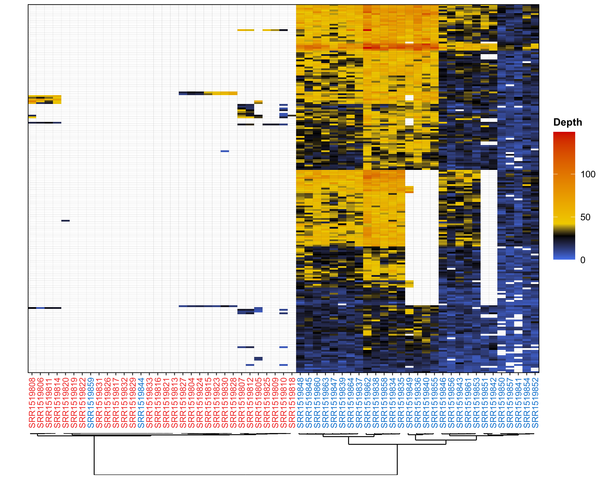
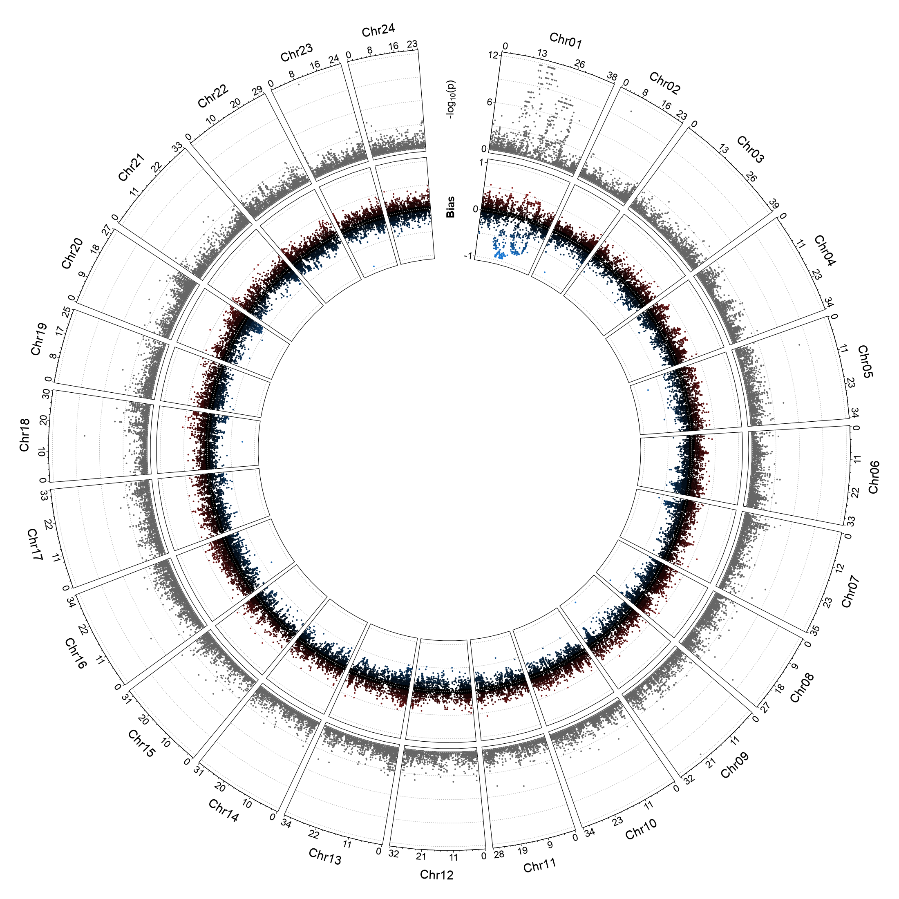
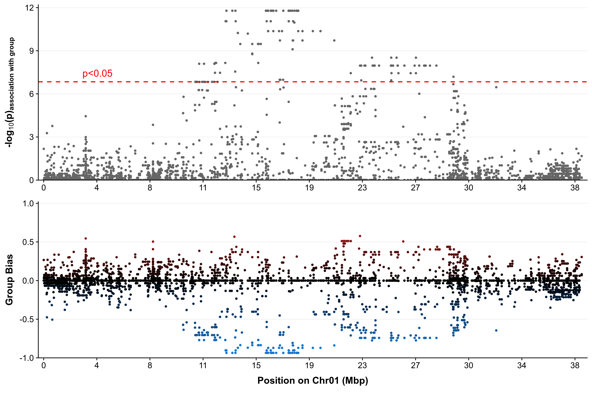

[](https://github.com/SexGenomicsToolkit/sgtr/releases)
[](https://bioconda.github.io/recipes/sgtr/README.html)
[](https://doi.org/xxx)

# sgtr

## Overview

R package to visualize results from population genomics analyses.
The package implements low-level function to generate genomics plots and high-level functions to visualize results from the Sex Genomics Toolkit.

The sgtr package development was initiatied in the [LPGP](https://www6.rennes.inra.fr/lpgp/) lab from INRA, Rennes, France.

## Installation

### Requirements

The package was developed and tested in R version 3.6.3. It's likely to work under older R versions but there may be unforeseen issues.

The current version of sgtr implements functions to visualize the results from:

- RADSex 1.0.0
- PSASS 3.0.1

### Install from Github

```R
# Installation from GitHub requires devtools
install.packages("devtools")
devtools::install_github("SexGenomicsToolkit/sgtr")
```

### Install from Bioconda

```bash
echo "coming soon"
```

## Quick start

Examples of data and scripts to generate plots from RADSex and PSASS results are provided in the `examples` folder. To get the detailed usage for each function, use R's built-in help command `?<function_name>`, for instance `?radsex_distrib` (or `?sgtr::radsex_distrib` if the package was not attached).

### RADSex

The package provides several high-level functions to generate plots from RADSex results (RADSex >= 1.0.0):

Function                | Description
----------------------- | ------------
`radsex_distrib`        | Generate a tile plot of distribution of markers between groups from the results of RADSex `distrib`
`radsex_markers_depth`  | Generate a marker depths heatmap from the results of RADSex `subset`, `signif`, or `process`.
`radsex_map_circos`     | Generate a circular plot for the entire genome from the results of RADSex `map`.
`radsex_map_manhattan`  | Generate a manhattan plot for the entire genome from the results of RADSex `map`.
`radsex_map_region`     | Generate a linear plot for a specific region from the results of RADSex `map`.
`radsex_depth`          | Generate a boxplot with the distribution of a metric for each group or a barplot of the metric's value for each sample for a metric from the results of RADSex `depth`.
`radsex_freq`           | Generate a plot of the distribution of a marker frequencies in all individuals from the results of RADSex `freq`.

**Examples of results**

- Distribution of markers between groups


- Markers depth with clustering



- Circos plot



- Region plot



### PSASS

High-level functions specifically for PSASS results have not been implemented yet (will come soon), but general purpose high-level functions can be used to plot PSASS results:

Function                | Description
----------------------- | ------------
`plot_circos`           | Generate a circular plot for the entire genome from a genomic metrics file.
`plot_manhattan`        | Generate a manhattan plot for the entire genome from a genomic metrics file.
`plot_region`           | Generate a linear plot for a specific region from from a genomic metrics file.

Check the file `psass.R` in `examples/` and the built-in R help pages for examples of how to use these functions.

## LICENSE

Copyright (C) 2020 Romain Feron

This program is free software: you can redistribute it and/or modify it under the terms of the GNU General Public License as published by the Free Software Foundation, either version 3 of the License, or (at your option) any later version.

This program is distributed in the hope that it will be useful, but WITHOUT ANY WARRANTY; without even the implied warranty of MERCHANTABILITY or FITNESS FOR A PARTICULAR PURPOSE. See the GNU General Public License for more details.

You should have received a copy of the GNU General Public License along with this program. If not, see https://www.gnu.org/licenses/
